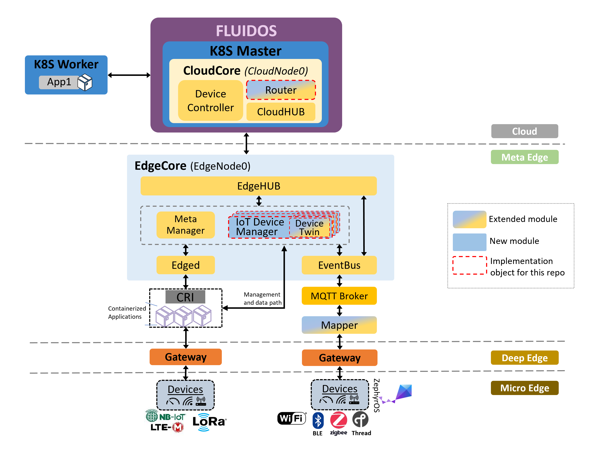

# Fluidos Edge System
This is a modified version of the [KubeEdge](https://github.com/kubeedge/kubeedge) repository designed to meet [Fluidos project](https://fluidos.eu) needs. It is a fork, or copy, of the official repository with changes made to align with the requirements of the project. The modifications will help to ensure that KubeEdge functions optimally within the Fluidos ecosystem. Additionally, these changes will enable the Fluidos team to contribute to the KubeEdge community by sharing their experiences with the modified version.

## Fluidos Edge architecture

## Features implementation phase

|                        | Fluidos Edge System v1.14 |
|------------------------|---------------------------|
| Router multicast       | OK                        |
| feature1               | Ongoing                   |
| feature2               | Rejected                  |
| featureN               | Pending review            |

## License

Fluidos Edge System is under the Apache 2.0 license. See the [LICENSE](LICENSE) file for details.
